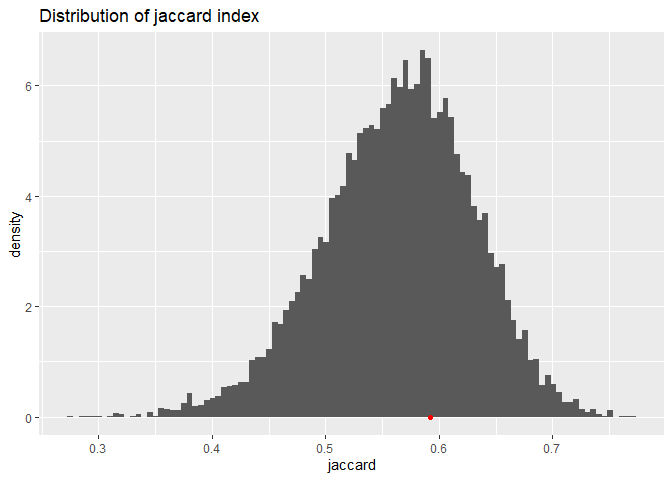

Power and Different sized hypervolumes
================

## Different sized hypervolumes from same data, tested with bootstrap and overlap test

``` r
# Generate size 150 and size 300 hypervolumes from combined data
#size_150_path = resample("quercus 150", hv_combine, "bootstrap", n = 100, points_per_resample = 150)
#size_300_path = resample("quercus 300", hv_combine, "bootstrap", n = 100, points_per_resample = 300)
size_150_path = "C:/Users/14842/Desktop/Hypervolumes-Resampling/Objects/quercus 150"
size_300_path = "C:/Users/14842/Desktop/Hypervolumes-Resampling/Objects/quercus 300"
```

``` r
diff_size_results = overlap.test(hv_150, hv_300, c(size_150_path, size_300_path))
```

``` r
diff_size_results$plots$jaccard
```

<!-- -->

``` r
diff_size_results$plots$sorensen
```

<!-- -->

``` r
diff_size_results$plots$frac_unique_1
```

<!-- -->

``` r
diff_size_results$plots$frac_unique_2
```

<!-- -->

## Power

``` r
base = hypervolume(rmvnorm(50, mean = c(0, 0), sigma = diag(nrow = 2)))
```

The result from the following code block (3 hr run time on 20 cores)
shows Jacarrd and Sorensen have the highest power.  
overlap.test will always show that sorensen and jaccard have the same p
value and same power since they preserve the same order of observed
value and resampled values.

Conducts test 100 times and calculate percent of time we get true
positive results i.e. p \< 0.05 Each test uses 400 (20 \* 20)
bootstrapped overlaps to generate null distribution.

``` r
#power1 = foreach(i = 1:100, .combine = rbind) %dopar% {
#  # Overlap base hypervolume with a hypervolume shifted 1/4 standard deviations in both dimension
#  compare_hv = hypervolume(rmvnorm(50, mean = c(0.25, 0.25), sigma = diag(nrow = 2)))
#  combine = hypervolume(rbind(base@Data, compare_hv@Data))
#  path = resample(paste0("power_test_", as.character(i)), combine, "bootstrap", n = 40)
#  path = file.path("./Objects", paste0("power_test_", i))
#  results = overlap.test(base, compare_hv, path)
#  unlist(results$p_values)
#}
```

## Confidence Interval

The two samples are from different species but have a lot of overlap in
Sepal width and Sepal length data.

``` r
data("iris")
hv1 = hypervolume(iris[iris$Species == "versicolor", c(1, 2)])
```

    ## 
    ## Building tree... 
    ## done.
    ## Ball query... 
    ## 
    ## done.
    ## 
    ## Building tree... 
    ## done.
    ## Ball query... 
    ## 
    ## done.
    ## 
    ## Building tree... 
    ## done.
    ## Ball query... 
    ## 
    ## done.
    ## 
    ## Building tree... 
    ## done.
    ## Ball query... 
    ## 
    ## done.
    ## 
    ## Building tree... 
    ## done.
    ## Ball query... 
    ## 
    ## done.
    ## Requested probability quantile 0.950000, obtained 0.949787 - setting threshold value 0.001300.
    ##  For a closer match, you can increase num.thresholds in hypervolume_threshold.

``` r
hv2 = hypervolume(iris[iris$Species == "virginica", c(1, 2)])
```

    ## 
    ## Building tree... 
    ## done.
    ## Ball query... 
    ## 
    ## done.
    ## 
    ## Building tree... 
    ## done.
    ## Ball query... 
    ## 
    ## done.
    ## 
    ## Building tree... 
    ## done.
    ## Ball query... 
    ## 
    ## done.
    ## 
    ## Building tree... 
    ## done.
    ## Ball query... 
    ## 
    ## done.
    ## 
    ## Building tree... 
    ## done.
    ## Ball query... 
    ## 
    ## done.
    ## Requested probability quantile 0.950000, obtained 0.949403 - setting threshold value 0.000866.
    ##  For a closer match, you can increase num.thresholds in hypervolume_threshold.

``` r
vscr_path = resample("versicolor resample", hv1, "bootstrap", n = 20, cores = 20)
```

    ## Warning in dir.create(file.path("./Objects", name)): '.\Objects\versicolor
    ## resample' already exists

``` r
vrgn_path = resample("virginica resample", hv2, "bootstrap", n = 20, cores = 20)
```

    ## Warning in dir.create(file.path("./Objects", name)): '.\Objects\virginica
    ## resample' already exists

``` r
overlap_confidence = overlap.confidence(vscr_path, vrgn_path)
```

``` r
overlap_confidence["jaccard"]
```

    ## $jaccard
    ##      2.5%     97.5% 
    ## 0.3566746 0.5546203

``` r
overlap_confidence["sorensen"]
```

    ## $sorensen
    ##      2.5%     97.5% 
    ## 0.5258070 0.7135123

``` r
overlap_confidence["frac_unique_1"]
```

    ## $frac_unique_1
    ##       2.5%      97.5% 
    ## 0.07055261 0.43539056

``` r
overlap_confidence["frac_unique_2"]
```

    ## $frac_unique_2
    ##      2.5%     97.5% 
    ## 0.3328332 0.5792494

## Volume bias estimation

Modified jackknife estimation of the bias (leave 2 out instead of leave
1 out) using the “k\_split” method of resample.

Due to change in bandwidth, the jackknife resamples are larger on
average than the observed volume. The calculated bias suggests that the
estimated volume is larger than the true volume.

``` r
#jackknife_sample = k_split("jackknife", hv_150, k = 75)
jackknife_sample = "C:/Users/14842/Desktop/Hypervolumes-Resampling/Objects/jackknife"
hvs_148 = to_hv_list(jackknife_sample)
bias = get_volume(hv_150) - mean(get_volume(hvs_148))
print(bias)
```

    ## untitled 
    ## 27.73747

``` r
stopCluster(cl)
stopImplicitCluster()
registerDoSEQ()
```
