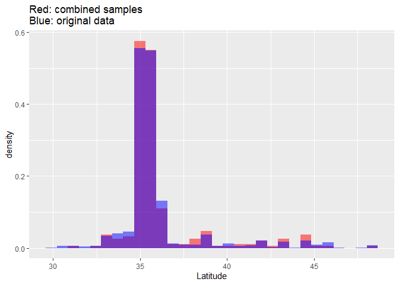
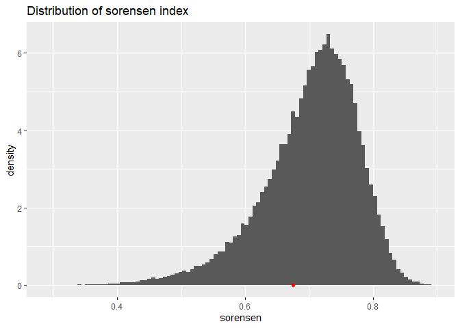
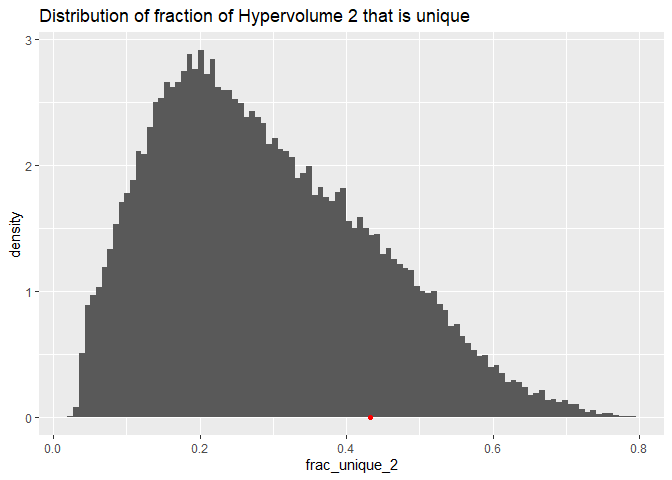

Combined Volume Approach
================

``` r
library(ggplot2)
library(hypervolume)
```

    ## Loading required package: Rcpp

    ## Loading required package: rgl

``` r
library(doParallel)
```

    ## Loading required package: foreach

    ## Loading required package: iterators

    ## Loading required package: parallel

``` r
source("Resample.R")
source("Overlap.R")
```

## Combined data from hypervolumes drawn from same distribution approximate distribution of original population

Drawn from normal distribution

``` r
sample1 = rnorm(150)
sample2 = rnorm(150)
func = function(x) {dnorm(x)}
ggplot(data.frame(sample1, sample2, x = seq(-3, 3, length.out = 150))) + 
  geom_histogram(aes(x = sample1, y = ..density.., fill = "red", alpha = 0.5), bins = 20) + 
  geom_histogram(aes(x = sample2, y = ..density.., fill = "blue", alpha = 0.5), bins = 20) +
  stat_function(fun = func)
```

<!-- -->

``` r
ggplot(data.frame(samples = c(sample1, sample2), x = seq(-3, 3, length.out = 300))) +
  geom_histogram(aes(x = samples, y = ..density.., alpha = 0.5), bins = 30) +
  stat_function(fun = func)
```

<!-- -->
Combined samples from sample data also approximate the distribution of
original data

``` r
data("quercus")
qsample1 = quercus[sample(1:nrow(quercus), 150),]
qsample2 = quercus[sample(1:nrow(quercus), 150),]
combined_sample = rbind(qsample1, qsample2)
ggplot(data = combined_sample) + geom_histogram(aes(x = Latitude, y = ..density..), fill = "red", alpha = 0.5) + geom_histogram(data = quercus, aes(x = Latitude, y = ..density..), fill = "blue", alpha = 0.5) + ggtitle("Red: combined samples \nBlue: original data")
```

    ## `stat_bin()` using `bins = 30`. Pick better value with `binwidth`.
    ## `stat_bin()` using `bins = 30`. Pick better value with `binwidth`.

<!-- -->

``` r
hv1 = hypervolume(qsample1[,2:3])
hv2 = hypervolume(qsample2[,2:3])
population_hat = hypervolume(combined_sample[,2:3])
```

``` r
#null_path = resample("quercus_150_null", population_hat, "bootstrap", n = 500, points_per_resample = 150, cores = 20)
null_path = "C:/Users/14842/Desktop/Hypervolumes-Resampling/Objects/quercus_150_null"

#Observed statistics
observed = hypervolume_overlap_statistics(hypervolume_set(hv1, hv2, check.memory = FALSE))
```

``` r
# optional code block for generating null distribution faster
cores = 20
cl = makeCluster(cores)
clusterEvalQ(cl, {
  library(hypervolume)
  library(foreach)
  source('Utils.R')
})
registerDoParallel(cl)
```

``` r
# Generate null distribution of statitics
null = foreach(i = 1:250, .combine = rbind) %:%
  foreach(j = 251:500, .combine = rbind) %dopar% {
    h1 = readRDS(file.path(null_path, list.files(null_path)[i]))
    h2 = readRDS(file.path(null_path, list.files(null_path)[j]))
    hypervolume_overlap_statistics(hypervolume_set(h1, h2, check.memory = FALSE))
  }
```

``` r
ggplot(data.frame(null), aes(x = jaccard, y = ..density..)) + 
  geom_histogram(bins = 100) + 
  geom_point(aes(x = observed["jaccard"], y = 0), color = "red") + 
  ggtitle("Distribution of jaccard index")
```

<!-- -->

``` r
ggplot(data.frame(null), aes(x = sorensen, y = ..density..)) + 
  geom_histogram(bins = 100) + 
  geom_point(aes(x = observed["sorensen"], y = 0), color = "red") + 
  ggtitle("Distribution of sorensen index")
```

<!-- -->

``` r
ggplot(data.frame(null), aes(x = frac_unique_1, y = ..density..)) + 
  geom_histogram(bins = 100) + 
  geom_point(aes(x = observed["frac_unique_1"], y = 0), color = "red") + 
  ggtitle("Distribution of fraction of Hypervolume 1 that is unique")
```

<!-- -->

``` r
ggplot(data.frame(null), aes(x = frac_unique_2, y = ..density..)) + 
  geom_histogram(bins = 100) + 
  geom_point(aes(x = observed["frac_unique_2"], y = 0), color = "red") + 
  ggtitle("Distribution of fraction of Hypervolume 2 that is unique")
```

<!-- -->

## Get power of each statistic from example case

setosa and versicolor clearly do not share the same distribution

``` r
data(iris)
ggplot(iris, aes(x = Sepal.Length, y = Sepal.Width, color = Species)) + geom_point()
```

<!-- -->

``` r
hv_setosa = hypervolume(iris[iris$Species == "setosa", 1:2])
hv_versicolor = hypervolume(iris[iris$Species == "versicolor", 1:2])
hv_combine = hypervolume(iris[iris$Species == "versicolor" | iris$Species == "setosa", 1:2])
```

``` r
#power_test_path = resample("power test bootstrap", hv_combine, "bootstrap", n = 200, points_per_resample = 50)
power_test_path = "C:/Users/14842/Desktop/Hypervolumes-Resampling/Objects/power test bootstrap"

# Observed statistics
observed_iris_stats = hypervolume_overlap_statistics(hypervolume_set(hv_setosa, hv_versicolor, check.memory = FALSE))
```

``` r
# Generate null distribution of statistics
null_iris = foreach(i = 1:100, .combine = rbind) %:%
  foreach(j = 101:200, .combine = rbind) %dopar% {
    h1 = readRDS(file.path(power_test_path, list.files(power_test_path)[i]))
    h2 = readRDS(file.path(power_test_path, list.files(power_test_path)[j]))
    hypervolume_overlap_statistics(hypervolume_set(h1, h2, check.memory = FALSE))
  }
```

``` r
ggplot(data.frame(null_iris), aes(x = jaccard, y = ..density..)) + 
  geom_histogram(bins = 100) + 
  geom_point(aes(x = observed_iris_stats["jaccard"], y = 0), color = "red") + 
  ggtitle("Distribution of jaccard index")
```

<!-- -->

``` r
ggplot(data.frame(null_iris), aes(x = sorensen, y = ..density..)) + 
  geom_histogram(bins = 100) + 
  geom_point(aes(x = observed_iris_stats["sorensen"], y = 0), color = "red") + 
  ggtitle("Distribution of sorensen index")
```

<!-- -->

``` r
ggplot(data.frame(null_iris), aes(x = frac_unique_1, y = ..density..)) + 
  geom_histogram(bins = 100) + 
  geom_point(aes(x = observed_iris_stats["frac_unique_1"], y = 0), color = "red") + 
  ggtitle("Distribution of fraction of Hypervolume 1 that is unique")
```

<!-- -->

``` r
ggplot(data.frame(null_iris), aes(x = frac_unique_2, y = ..density..)) + 
  geom_histogram(bins = 100) + 
  geom_point(aes(x = observed_iris_stats["frac_unique_2"], y = 0), color = "red") + 
  ggtitle("Distribution of fraction of Hypervolume 2 that is unique")
```

<!-- -->

## Permutations

Use quercus to permute

``` r
#perm_path = permute("Quercus_perm_150", hv1, hv2, n = 200, cores = 20)
perm_path = "C:/Users/14842/Desktop/Hypervolumes-Resampling/Objects/Quercus_perm_150"
```

Permutation tests a slightly different hypothesis but gives similar
distribution as bootstrapping.

``` r
ggplot(data.frame(perm_null), aes(x = jaccard, y = ..density..)) +
  geom_histogram(aes(x = jaccard, y = ..density..), data = data.frame(null), bins = 100, fill = "blue", alpha = 0.5) +
  geom_histogram(bins = 30, fill = "red", alpha = 0.5) + 
  geom_point(aes(x = observed["jaccard"], y = 0), color = "blue") + 
  ggtitle("Distribution of jaccard index")
```

<!-- -->

``` r
ggplot(data.frame(perm_null), aes(x = sorensen, y = ..density..)) + 
  geom_histogram(aes(x = sorensen, y = ..density..), data = data.frame(null), bins = 100, fill = "blue", alpha = 0.5) +
  geom_histogram(bins = 30, fill = "red", alpha = 0.5) + 
  geom_point(aes(x = observed["sorensen"], y = 0), color = "blue") + 
  ggtitle("Distribution of sorensen index")
```

<!-- -->

``` r
ggplot(data.frame(perm_null), aes(x = frac_unique_1, y = ..density..)) + 
  geom_histogram(aes(x = frac_unique_1, y = ..density..), data = data.frame(null), bins = 100, fill = "blue", alpha = 0.5) +
  geom_histogram(bins = 30, fill = "red", alpha = 0.5) +
  geom_point(aes(x = observed["frac_unique_1"], y = 0), color = "blue") + 
  ggtitle("Distribution of fraction of Hypervolume 1 that is unique")
```

<!-- -->

``` r
ggplot(data.frame(perm_null), aes(x = frac_unique_2, y = ..density..)) + 
  geom_histogram(aes(x = frac_unique_2, y = ..density..), data = data.frame(null), bins = 100, fill = "blue", alpha = 0.5) +
  geom_histogram(bins = 30, fill = "red", alpha = 0.5) + 
  geom_point(aes(x = observed["frac_unique_2"], y = 0), color = "blue") + 
  ggtitle("Distribution of fraction of Hypervolume 2 that is unique")
```

<!-- -->

## Results from overlap.test

overlap.test returns a list of results  
\- $p-values: a list of p-values for each of the four statistics
returned by hypervolume\_overlap\_statistics.  
\- $plots: a list of plots for each statistic that show null
distribution and value observed by hv1 and hv2.  
\- $distribution: matrix of bootstrap or permutation results used to
generate the plotted distribution  
The method detects whether to generate distribution for a permutation or
bootstrap test based on file structure of input path.

``` r
results = overlap.test(hv1, hv2, null_path)
```

    ## Choosing num.points.max=25955 (use a larger value for more accuracy.)
    ## Using minimum density of 51.433274
    ## Retaining 6712 points in hv1 and 9867 points in hv2.
    ## Beginning ball queries... 
    ## 
    ## Building tree... 
    ## done.
    ## Ball query... 
    ## 
    ## done.
    ## 
    ## Building tree... 
    ## done.
    ## Ball query... 
    ## 
    ## done.
    ## Finished ball queries.

``` r
p = results$p_values$jaccard
print(paste("p-value for Jaccard index:", p))
```

    ## [1] "p-value for Jaccard index: 0.310176"

``` r
results$plots$jaccard
```

<!-- -->

``` r
perm_results = overlap.test(hv1, hv2, perm_path, bins = 30)
```

    ## Choosing num.points.max=25955 (use a larger value for more accuracy.)
    ## Using minimum density of 51.433274
    ## Retaining 6712 points in hv1 and 9867 points in hv2.
    ## Beginning ball queries... 
    ## 
    ## Building tree... 
    ## done.
    ## Ball query... 
    ## 
    ## done.
    ## 
    ## Building tree... 
    ## done.
    ## Ball query... 
    ## 
    ## done.
    ## Finished ball queries.

``` r
p = perm_results$p_values$jaccard
print(paste("p-value for Jaccard index:", p))
```

    ## [1] "p-value for Jaccard index: 0.435"

``` r
perm_results$plots$jaccard
```

<!-- -->

``` r
stopCluster(cl)
stopImplicitCluster()
registerDoSEQ()
```
