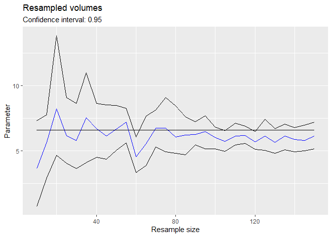
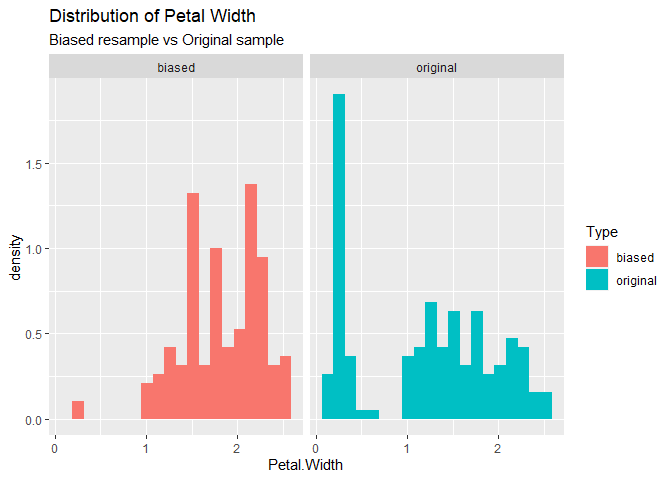
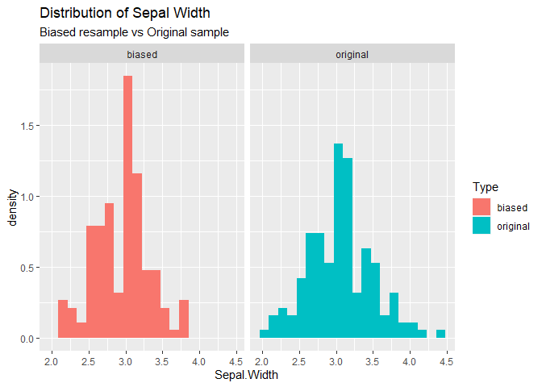

Use Cases
================
Daniel Chen
4/15/2020

``` r
data(iris)
source('resample.R')
```

    ## Loading required package: Rcpp

    ## Loading required package: rgl

``` r
source('cross_validate.R')
source('Funnels.R')
```

    ## 
    ## Attaching package: 'dplyr'

    ## The following objects are masked from 'package:stats':
    ## 
    ##     filter, lag

    ## The following objects are masked from 'package:base':
    ## 
    ##     intersect, setdiff, setequal, union

``` r
hv = hypervolume(iris[,c(1, 2)])
```

    ## 
    ## Building tree... 
    ## done.
    ## Ball query... 
    ## 
    ## done.
    ## 
    ## Building tree... 
    ## done.
    ## Ball query... 
    ## 
    ## done.
    ## 
    ## Building tree... 
    ## done.
    ## Ball query... 
    ## 
    ## done.
    ## 
    ## Building tree... 
    ## done.
    ## Ball query... 
    ## 
    ## done.
    ## Requested probability quantile 0.950000, obtained 0.949783 - setting threshold value 0.000180.
    ##  For a closer match, you can increase num.thresholds in hypervolume_threshold.

## Generate Hypervolume and Resample

Using the hypervolume that models the first two columns of the iris data
set, we generate a sequence of
bootstraps.

``` r
# Samples i rows from the data that generated hv for each i in seq, then generates a bootstrap on each of these i resamples and saves to file.
# Runtime ~2hrs
# hv_bootstrap_seq <- resample('hv_bootstrap_seq', hv, method = 'bootstrap seq', points_per_resample = "sample size", seq = seq(10, 150, length.out = 29))
# Here is the result of running the above code
hv_bootstrap_seq <- "./Objects/hv_bootstrap_seq"
```

By creating funnel plots using the bootstrap sequence, we can see that
our mean resampled data and mean random points both converge to the mean
of our original sample.

``` r
par(mfrow=c(1,2))
funnel(hv_bootstrap_seq, title = 'From resampled data', func = function(x) {mean(x@Data[,1])}) + 
  geom_line(aes(y = mean(hv@Data[,1]))) + 
  ylim(5.25, 6.5) +
  ylab('Mean Sepal Length')
funnel(hv_bootstrap_seq, title = 'From random points', func = function(x) {mean(x@RandomPoints[,1])}) + 
  geom_line(aes(y = mean(hv@Data[,1]))) + 
  ylim(5.25, 6.5) +
  ylab(NULL)
```


Variance of a kernel density estimate is greater than sample variance as
expected, but converges to sample variance for large n.  
Bootstrapped volumes seem unbiased; however the 95% confidence interval
is skewed.

``` r
par(mfrow=c(1,2))
funnel(hv_bootstrap_seq, title = 'Resampled variances from random points', func = function(x) {var(x@RandomPoints[,1])}) + 
  geom_line(aes(y = var(hv@Data[,1])))

funnel(hv_bootstrap_seq, title = 'Resampled volumes', func = get_volume) + 
  geom_line(aes(y = get_volume(hv)))
```



## Biased resample

We consider the iris dataset and want to see how a biased sampling
method affects the data. For example, we suspect flowers with larger and
more visible petals are over counted. To simulate overcounting petals,
we perform a biased bootstrap.

``` r
# Hypervolume generated from iris data
hv = hypervolume(iris[,1:4])
```

    ## Warning in hypervolume(iris[, 1:4]): 
    ## Consider removing some axes.

    ## 
    ## Building tree... 
    ## done.
    ## Ball query... 
    ## 
    ## done.
    ## 
    ## Building tree... 
    ## done.
    ## Ball query... 
    ## 
    ## done.
    ## 
    ## Building tree... 
    ## done.
    ## Ball query... 
    ## 
    ## done.
    ## 
    ## Building tree... 
    ## done.
    ## Ball query... 
    ## 
    ## done.
    ## 
    ## Building tree... 
    ## done.
    ## Ball query... 
    ## 
    ## done.
    ## Requested probability quantile 0.950000, obtained 0.947124 - setting threshold value 0.000019.
    ##  For a closer match, you can increase num.thresholds in hypervolume_threshold.

``` r
# Weigh points with large values for petal length and petal width higher
biased_path = resample("Petal bias", hv, method = "biased bootstrap", n = 1, mu = apply(hv@Data, 2, max)[c("Petal.Length", "Petal.Width")], sigma = apply(hv@Data, 2, sd)[c("Petal.Length", "Petal.Width")]*2, cols_to_bias = c("Petal.Length", "Petal.Width"))
```

    ## Warning in dir.create(file.path("./Objects", name)): '.\Objects\Petal bias'
    ## already exists

``` r
biased_hv = readRDS(file.path(biased_path, "resample 1.rds"))
```

``` r
ggplot(data.frame(hv@Data), aes(y = ..density..)) + 
  geom_histogram(aes(x = Petal.Width), bins = 20, fill = 'blue', alpha = 0.5) + 
  geom_histogram(aes(x = Petal.Length), bins = 20, fill = 'red', alpha = 0.5) + 
  ggtitle("Unbiased distribution of petal length and width")
ggplot(data.frame(biased_hv@Data), aes(y = ..density..)) + 
  geom_histogram(aes(x = Petal.Width), bins = 20, fill = 'blue', alpha = 0.5) + 
  geom_histogram(aes(x = Petal.Length), bins = 20, fill = 'red', alpha = 0.5) + 
  ggtitle("Biased distribution of petal length and width")
```


Effect on sepal width and sepal length

``` r
ggplot(data.frame(hv@Data), aes(y = ..density..)) + 
  geom_histogram(aes(x = Sepal.Width), bins = 20, fill = 'blue', alpha = 0.5) + 
  geom_histogram(aes(x = Sepal.Length), bins = 20, fill = 'red', alpha = 0.5) + 
  ggtitle("Unbiased distribution of sepal length and width")
ggplot(data.frame(biased_hv@Data), aes(y = ..density..)) + 
  geom_histogram(aes(x = Sepal.Width), bins = 20, fill = 'blue', alpha = 0.5) + 
  geom_histogram(aes(x = Sepal.Length), bins = 20, fill = 'red', alpha = 0.5) + 
  ggtitle("Biased distribution of sepal length and width")
```


