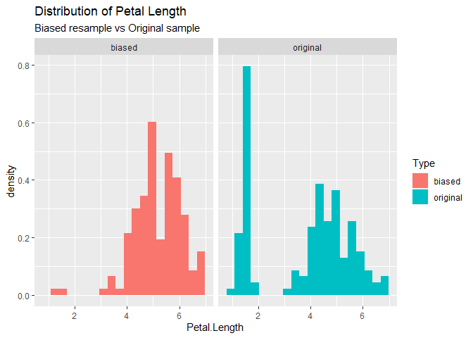
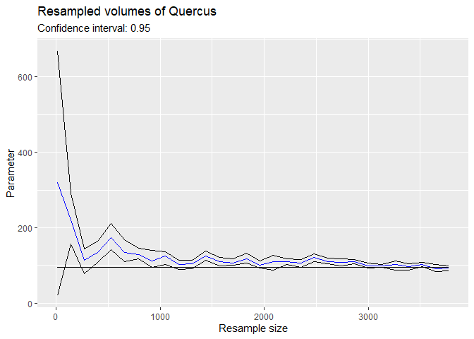

Use Cases
================
Daniel Chen
4/15/2020

``` r
source('resample.R')
```

    ## Loading required package: Rcpp

    ## Loading required package: rgl

    ## Loading required package: iterators

    ## Loading required package: parallel

``` r
source('Funnels.R')
```

    ## 
    ## Attaching package: 'dplyr'

    ## The following objects are masked from 'package:stats':
    ## 
    ##     filter, lag

    ## The following objects are masked from 'package:base':
    ## 
    ##     intersect, setdiff, setequal, union

``` r
source('Utils.R')
data(iris)
data(quercus)
hv = hypervolume(iris[,c(1, 2)])
```

    ## 
    ## Building tree... 
    ## done.
    ## Ball query... 
    ## 
    ## done.
    ## 
    ## Building tree... 
    ## done.
    ## Ball query... 
    ## 
    ## done.
    ## 
    ## Building tree... 
    ## done.
    ## Ball query... 
    ## 
    ## done.
    ## 
    ## Building tree... 
    ## done.
    ## Ball query... 
    ## 
    ## done.
    ## Requested probability quantile 0.950000, obtained 0.949989 - setting threshold value 0.000180.
    ##  For a closer match, you can increase num.thresholds in hypervolume_threshold.

## Generate Hypervolume and Resample

Using the hypervolume that models the first two columns of the iris data
set, we generate a sequence of bootstraps.

``` r
# Samples i rows from the data that generated hv for each i in seq, then generates a bootstrap on each of these i resamples and saves to file.
# Runtime ~2hrs
# hv_bootstrap_seq <- resample('hv_bootstrap_seq', hv, method = 'bootstrap seq', points_per_resample = "sample_size", seq = seq(10, 150, length.out = 29))
# Here is the result of running the above code
hv_bootstrap_seq <- "./Objects/hv_bootstrap_seq"
```

By creating funnel plots using the bootstrap sequence, we can see that
our mean resampled data and mean random points both converge to the mean
of our original sample.

``` r
funnel(hv_bootstrap_seq, title = 'From resampled data', func = function(x) {mean(x@Data[,1])}) + 
  geom_line(aes(y = mean(hv@Data[,1]))) + 
  ylim(5.25, 6.5) +
  ylab('Mean Sepal Length')
funnel(hv_bootstrap_seq, title = 'From random points', func = function(x) {mean(x@RandomPoints[,1])}) + 
  geom_line(aes(y = mean(hv@Data[,1]))) + 
  ylim(5.25, 6.5) +
  ylab('Mean Sepal Length')
```


Variance of a kernel density estimate is greater than sample variance as
expected, but converges to sample variance for large n.  
Bootstrapped volumes seem unbiased; however the 95% confidence interval
is skewed.

``` r
funnel(hv_bootstrap_seq, title = 'Resampled variances from random points', func = function(x) {var(x@RandomPoints[,1])}) + 
  geom_line(aes(y = var(hv@Data[,1])))

funnel(hv_bootstrap_seq, title = 'Resampled volumes', func = get_volume) + 
  geom_line(aes(y = get_volume(hv)))
```


## Biased resample

We consider the iris dataset and want to see how a biased sampling
method affects the data. For example, we suspect flowers with larger and
more visible petals are over counted. To simulate overcounting plants
with large petals, we perform a biased bootstrap.

``` r
# Hypervolume generated from iris data
hv = hypervolume(iris[,1:4])
```

    ## Warning in hypervolume(iris[, 1:4]): 
    ## Consider removing some axes.

    ## 
    ## Building tree... 
    ## done.
    ## Ball query... 
    ## 
    ## done.
    ## 
    ## Building tree... 
    ## done.
    ## Ball query... 
    ## 
    ## done.
    ## 
    ## Building tree... 
    ## done.
    ## Ball query... 
    ## 
    ## done.
    ## 
    ## Building tree... 
    ## done.
    ## Ball query... 
    ## 
    ## done.
    ## 
    ## Building tree... 
    ## done.
    ## Ball query... 
    ## 
    ## done.
    ## Requested probability quantile 0.950000, obtained 0.948062 - setting threshold value 0.000019.
    ##  For a closer match, you can increase num.thresholds in hypervolume_threshold.

``` r
# Weigh points with large values for petal length and petal width higher
biased_path = resample("Petal bias", hv, method = "biased bootstrap", n = 1, mu = apply(hv@Data, 2, max)[c("Petal.Length", "Petal.Width")], sigma = apply(hv@Data, 2, var)[c("Petal.Length", "Petal.Width")]*2, cols_to_bias = c("Petal.Length", "Petal.Width"))
```

    ## Warning in dir.create(file.path("./Objects", name)): '.\Objects\Petal bias'
    ## already exists

    ## Warning: executing %dopar% sequentially: no parallel backend registered

``` r
biased_hv = readRDS(file.path(biased_path, "resample 1.rds"))
# Combine resulting data in a dataframe
dat = data.frame(rbind(hv@Data, biased_hv@Data))
dat['Type'] = rep(c('original', 'biased'), each = 150)
```

Effect on petal width and petal length

``` r
ggplot(dat, aes(y = ..density..)) + geom_histogram(aes(x = Petal.Width, fill = Type), bins = 20) + 
  facet_wrap(~Type) + 
  ggtitle("Distribution of Petal Width", "Biased resample vs Original sample")
ggplot(dat, aes(y = ..density..)) + geom_histogram(aes(x = Petal.Length, fill = Type), bins = 20) + 
  facet_wrap(~Type) + 
  ggtitle("Distribution of Petal Length", "Biased resample vs Original sample")
```



Effect on sepal width and sepal length

``` r
ggplot(dat, aes(y = ..density..)) + geom_histogram(aes(x = Sepal.Width, fill = Type), bins = 20) + 
  facet_wrap(~Type) + 
  ggtitle("Distribution of Sepal Width", "Biased resample vs Original sample")
ggplot(dat, aes(y = ..density..)) + geom_histogram(aes(x = Sepal.Length, fill = Type), bins = 20) + 
  facet_wrap(~Type) + 
  ggtitle("Distribution of Sepal Length", "Biased resample vs Original sample")
```


\#\# Tests on Quercus data

``` r
hv_quercus = hypervolume(quercus[,c(2,3)])
```

    ## 
    ## Building tree... 
    ## done.
    ## Ball query... 
    ## 
    ## done.
    ## Requested probability quantile 0.950000, obtained 0.940446 - setting threshold value 0.000000.
    ##  For a closer match, you can increase num.thresholds in hypervolume_threshold.

``` r
# Runtime ~6hrs
# quercus_bootstrap_seq <- resample('quercus_bootstrap_seq', hv_quercus, method = 'bootstrap seq', points_per_resample = "sample_size", seq = floor(seq(10, 3779, length.out = 30)))
quercus_bootstrap_seq <- "./Objects/quercus_bootstrap_seq"
```

The funnel plot of volume shows that the sample volume is biased towards
lower values. For some of the resamples, all resampled hypervolumes had
smaller volume than the original sample.

``` r
funnel(quercus_bootstrap_seq, title = 'Resampled volumes of Quercus', func = get_volume) + 
  geom_line(aes(y = get_volume(hv_quercus)))
```

<!-- --> When
performing biased resampling, the volume becomes significantly smaller
if biasing towards a single point.

``` r
# bias towards mean latitude
mu = mean(hv_quercus@Data[,2])
sigma = 3*var(hv_quercus@Data[,2])
# Biased bootstrap on hv_quercus
# Runtime ~ 20min
# center_bias = resample('quercus bias', hv_quercus, method = 'biased bootstrap', mu = mu, sigma = sigma, cols_to_bias = 2)
biased_quercus_hvs = to_hv_list("./Objects/quercus bias")
weight_func = function(x) {dnorm(x, mu, sqrt(sigma))}
ggplot(quercus, aes(x = Longitude)) + stat_function(fun = weight_func) + 
  geom_rug() +
  ggtitle('Weights biased towards mean longitude') +
  ylab('resampling weights')
ggplot(data.frame(volume = get_volume(biased_quercus_hvs)), aes(x = volume)) + 
  geom_histogram(bins = 5) +
  ggtitle('Volumes of hypervolumes biased towards mean longitude', 'Original volume: 106.8')
```


## Computing in parallel

``` r
hv = hypervolume(iris[,1:2])
```

    ## 
    ## Building tree... 
    ## done.
    ## Ball query... 
    ## 
    ## done.
    ## 
    ## Building tree... 
    ## done.
    ## Ball query... 
    ## 
    ## done.
    ## 
    ## Building tree... 
    ## done.
    ## Ball query... 
    ## 
    ## done.
    ## 
    ## Building tree... 
    ## done.
    ## Ball query... 
    ## 
    ## done.
    ## Requested probability quantile 0.950000, obtained 0.949632 - setting threshold value 0.000180.
    ##  For a closer match, you can increase num.thresholds in hypervolume_threshold.

``` r
system.time({
  resample("non-parallel test", hv, "bootstrap", n = 30)
})
```

    ## Warning in dir.create(file.path("./Objects", name)): '.\Objects\non-parallel
    ## test' already exists

    ##    user  system elapsed 
    ##   82.56    0.27   82.75

``` r
system.time({
  resample("parallel test", hv, "bootstrap", n = 30, cores = 4)
})
```

    ## Warning in dir.create(file.path("./Objects", name)): '.\Objects\parallel test'
    ## already exists

    ##    user  system elapsed 
    ##    0.06    0.08   28.60

``` r
system.time({
  resample("non-parallel bias test", hv, "biased bootstrap", n = 30, mu = c(3, 3), sigma = c(1, 1))
})
```

    ## Warning in dir.create(file.path("./Objects", name)): '.\Objects\non-parallel
    ## bias test' already exists

    ##    user  system elapsed 
    ##   76.55    0.34   76.82

``` r
system.time({
  resample("parallel bias test", hv, "biased bootstrap", n = 30, mu = c(3, 3), sigma = c(1, 1), cores = 4)
})
```

    ## Warning in dir.create(file.path("./Objects", name)): '.\Objects\parallel bias
    ## test' already exists

    ##    user  system elapsed 
    ##    0.06    0.02   26.70

``` r
system.time({
  resample("non-parallel bias test", hv, "bootstrap seq", n = 30, seq = c(50, 100, 150))
})
```

    ## Warning in dir.create(file.path("./Objects", name)): '.\Objects\non-parallel
    ## bias test' already exists

    ## Warning in dir.create(file.path("./Objects", name, subdir)): '.\Objects\non-
    ## parallel bias test\sample size 50' already exists

    ## Warning in dir.create(file.path("./Objects", name)): '.\Objects\non-parallel
    ## bias test\sample size 50' already exists

    ## Warning in dir.create(file.path("./Objects", name, subdir)): '.\Objects\non-
    ## parallel bias test\sample size 100' already exists

    ## Warning in dir.create(file.path("./Objects", name)): '.\Objects\non-parallel
    ## bias test\sample size 100' already exists

    ## Warning in dir.create(file.path("./Objects", name, subdir)): '.\Objects\non-
    ## parallel bias test\sample size 150' already exists

    ## Warning in dir.create(file.path("./Objects", name)): '.\Objects\non-parallel
    ## bias test\sample size 150' already exists

    ##    user  system elapsed 
    ##  145.14    0.53  145.53

``` r
system.time({
  resample("parallel bias test", hv, "bootstrap seq", n = 30, seq = c(50, 100, 150), cores = 10)
})
```

    ## Warning in dir.create(file.path("./Objects", name)): '.\Objects\parallel bias
    ## test' already exists

    ##    user  system elapsed 
    ##    0.04    0.15   94.03
